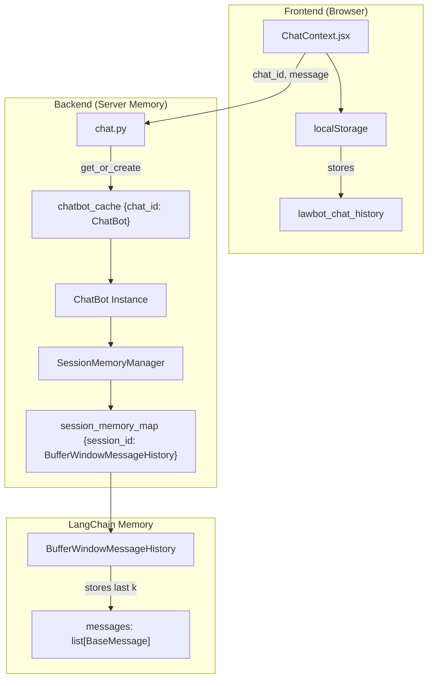
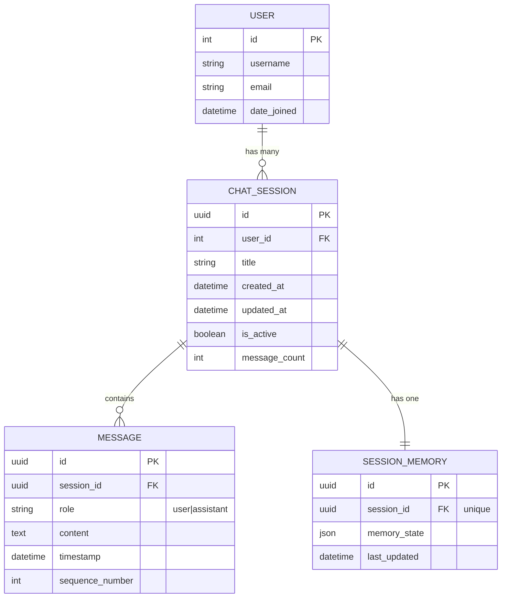
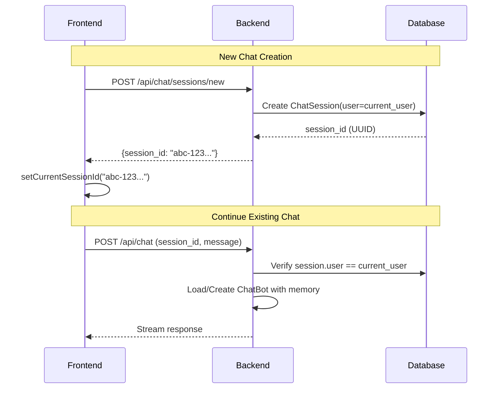
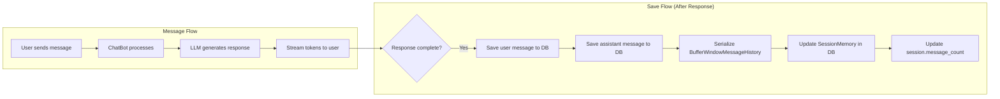
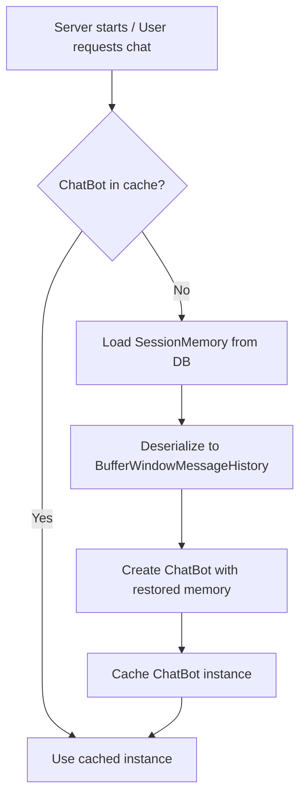
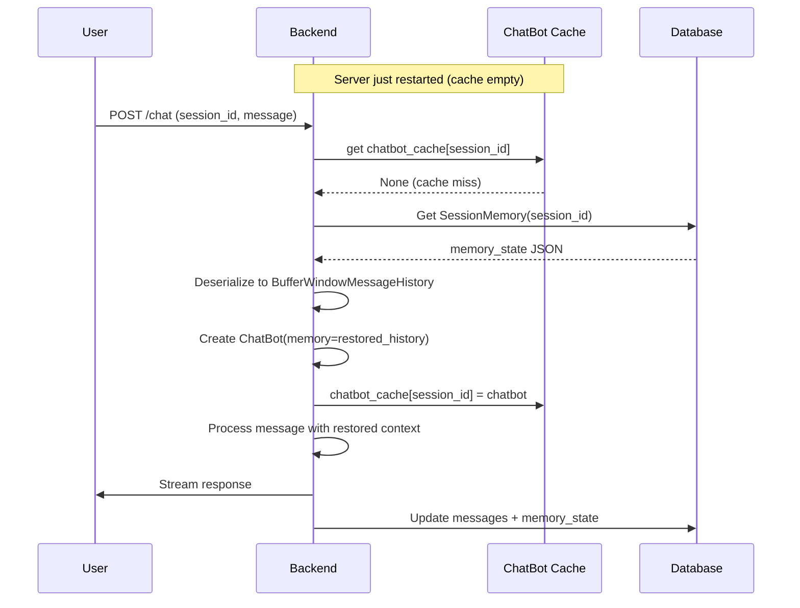

# Chat Session Persistence Implementation Plan

**Goal**: Implement database-backed chat sessions with memory persistence, allowing users to have up to 10 chats with ~20 message pairs each, with automatic session recovery on server restart.

---

## Current System Analysis

### How the Chatbot Currently Works



### Current Memory Flow

1. **Frontend** (`ChatContext.jsx`):

   - Generates `currentSessionId` via `crypto.randomUUID()`
   - Stores chat history in `localStorage` under `lawbot_chat_history`
   - Each session has: `id`, `title`, `messages`, `createdAt`, `updatedAt`

2. **Backend** (`chat.py`):

   - `chatbot_cache` = in-memory `{chat_id: ChatBot}` dictionary
   - Creates new `ChatBot()` instance per unique `chat_id`

3. **Session Memory** (`SessionManager.py`):

   - `SessionMemoryManager.session_memory_map` = static dictionary `{session_id: BufferWindowMessageHistory}`
   - Each session gets its own sliding window history

4. **Message History** (`History.py`):
   - `BufferWindowMessageHistory` keeps only last `k` messages (default: 4)
   - Uses LangChain's `BaseChatMessageHistory` base class
   - `add_messages()` appends and trims to `k` messages

### Current Limitations

| Issue                  | Current Behavior                       | Impact                              |
| ---------------------- | -------------------------------------- | ----------------------------------- |
| **Server Restart**     | All memory lost                        | Users lose conversation context     |
| **Memory Volatility**  | Stored in RAM only                     | No persistence                      |
| **Per-User Isolation** | Same `chat_id` namespace for all users | No user separation                  |
| **Chat Limit**         | Unlimited (frontend localStorage)      | No control, potential storage bloat |

---

## Proposed Database Schema

> [!IMPORTANT]
> We need 3 new Django models: `ChatSession`, `Message`, and `SessionMemory`.

### Entity Relationship Diagram



### Django Models

#### [NEW] `backend/database/models/chat.py`

```python
from django.db import models
from django.conf import settings
import uuid

class ChatSession(models.Model):
    """
    Represents a chat conversation session for a user.
    Each user can have up to 10 active sessions.
    """
    id = models.UUIDField(primary_key=True, default=uuid.uuid4, editable=False)
    user = models.ForeignKey(
        settings.AUTH_USER_MODEL,
        on_delete=models.CASCADE,
        related_name='chat_sessions'
    )
    title = models.CharField(max_length=255, default='New Chat')
    created_at = models.DateTimeField(auto_now_add=True)
    updated_at = models.DateTimeField(auto_now=True)
    is_active = models.BooleanField(default=True)
    message_count = models.PositiveIntegerField(default=0)

    class Meta:
        db_table = 'chat_sessions'
        ordering = ['-updated_at']
        indexes = [
            models.Index(fields=['user', '-updated_at']),
        ]

    def __str__(self):
        return f"{self.user.username} - {self.title}"


class Message(models.Model):
    """
    Individual message within a chat session.
    Stores both user and assistant messages.
    """
    ROLE_CHOICES = [
        ('user', 'User'),
        ('assistant', 'Assistant'),
    ]

    id = models.UUIDField(primary_key=True, default=uuid.uuid4, editable=False)
    session = models.ForeignKey(
        ChatSession,
        on_delete=models.CASCADE,
        related_name='messages'
    )
    role = models.CharField(max_length=10, choices=ROLE_CHOICES)
    content = models.TextField()
    timestamp = models.DateTimeField(auto_now_add=True)
    sequence_number = models.PositiveIntegerField()

    class Meta:
        db_table = 'messages'
        ordering = ['sequence_number']
        indexes = [
            models.Index(fields=['session', 'sequence_number']),
        ]

    def __str__(self):
        return f"{self.role}: {self.content[:50]}..."


class SessionMemory(models.Model):
    """
    Stores the LangChain memory state for session recovery.
    Contains serialized BufferWindowMessageHistory.
    """
    id = models.UUIDField(primary_key=True, default=uuid.uuid4, editable=False)
    session = models.OneToOneField(
        ChatSession,
        on_delete=models.CASCADE,
        related_name='memory'
    )
    memory_state = models.JSONField(default=list)  # Serialized messages
    last_updated = models.DateTimeField(auto_now=True)

    class Meta:
        db_table = 'session_memories'

    def __str__(self):
        return f"Memory for {self.session.id}"
```

---

## Session ID Strategy

> [!IMPORTANT] > **Decision: Each user has their OWN set of unique session IDs (UUIDs)**

### Why User-Scoped Session IDs?

| Approach                  | Pros                                 | Cons                                |
| ------------------------- | ------------------------------------ | ----------------------------------- |
| **Global UUIDs (Chosen)** | Simple, no collisions, URL-shareable | Slightly more storage               |
| **User-prefixed IDs**     | Easy user filtering                  | More complex                        |
| **Sequential per-user**   | Compact IDs                          | Collision risk, harder to implement |

### Session ID Flow



---

## Memory Persistence Architecture

### How Memory Gets Saved



### How Memory Gets Loaded (Session Recovery)



---

## API Endpoints Design

### New Endpoints Required

| Endpoint                   | Method | Purpose                            | Auth Required |
| -------------------------- | ------ | ---------------------------------- | ------------- |
| `/api/chat/sessions/`      | GET    | List user's chat sessions (max 10) | Yes           |
| `/api/chat/sessions/`      | POST   | Create new session                 | Yes           |
| `/api/chat/sessions/{id}/` | GET    | Get session with messages          | Yes           |
| `/api/chat/sessions/{id}/` | DELETE | Delete session                     | Yes           |
| `/api/chat/`               | POST   | Chat (with session_id)             | Yes           |

### Session List Response

```json
{
  "sessions": [
    {
      "id": "abc-123-uuid",
      "title": "Constitutional Rights Query",
      "created_at": "2025-12-29T10:00:00Z",
      "updated_at": "2025-12-29T14:30:00Z",
      "message_count": 12,
      "is_active": true
    }
  ],
  "total_count": 3,
  "max_sessions": 10
}
```

### Load Session Response

```json
{
  "id": "abc-123-uuid",
  "title": "Constitutional Rights Query",
  "messages": [
    {
      "id": "msg-1",
      "role": "user",
      "content": "What is Article 10?",
      "timestamp": "2025-12-29T10:00:00Z"
    },
    {
      "id": "msg-2",
      "role": "assistant",
      "content": "Article 10 of the Constitution...",
      "timestamp": "2025-12-29T10:00:05Z"
    }
  ]
}
```

---

## Chat Limit Enforcement (10 Chats, 20 Pairs Each)

### Limit Configuration

```python
# backend/core/configs/settings.py
CHAT_LIMITS = {
    'MAX_SESSIONS_PER_USER': 10,
    'MAX_MESSAGES_PER_SESSION': 40,  # 20 pairs = 40 messages
    'MEMORY_WINDOW_SIZE': 8,  # Last 4 pairs for LLM context
}
```

### Enforcement Logic

```mermaid
flowchart TB
    subgraph "New Session Creation"
        A[User requests new chat] --> B{sessions.count >= 10?}
        B -->|Yes| C[Return error: "Max sessions reached"]
        B -->|No| D[Create new session]
    end

    subgraph "Message Limit"
        E[User sends message] --> F{message_count >= 40?}
        F -->|Yes| G[Return error: "Session full"]
        F -->|No| H[Process message]
    end
```

---

## Memory Serialization Format

### Storing LangChain Messages

```python
# Serialization (History -> JSON)
def serialize_memory(history: BufferWindowMessageHistory) -> list[dict]:
    return [
        {
            "type": msg.__class__.__name__,  # "HumanMessage" or "AIMessage"
            "content": msg.content,
        }
        for msg in history.messages
    ]

# Deserialization (JSON -> History)
def deserialize_memory(data: list[dict], k: int = 8) -> BufferWindowMessageHistory:
    from langchain_core.messages import HumanMessage, AIMessage

    history = BufferWindowMessageHistory(k=k)
    messages = []
    for item in data:
        if item["type"] == "HumanMessage":
            messages.append(HumanMessage(content=item["content"]))
        else:
            messages.append(AIMessage(content=item["content"]))

    history.messages = messages[-k:]  # Keep only last k
    return history
```

---

## Implementation Files

### Files to Modify

| File                                      | Changes                             |
| ----------------------------------------- | ----------------------------------- |
| `backend/database/models/__init__.py`     | Export new models                   |
| `backend/core/services/SessionManager.py` | Add DB persistence methods          |
| `backend/api/views/chat.py`               | Add session management, auth checks |
| `backend/api/urls/chat.py`                | Add new endpoint routes             |

### New Files

| File                                       | Purpose                                    |
| ------------------------------------------ | ------------------------------------------ |
| `backend/database/models/chat.py`          | ChatSession, Message, SessionMemory models |
| `backend/api/views/sessions.py`            | Session CRUD endpoints                     |
| `backend/api/serializers/chat.py`          | DRF serializers for chat models            |
| `backend/core/services/ChatPersistence.py` | Memory save/load service                   |

---

## Server Recovery Flow

> [!IMPORTANT]
> When server restarts, memory is restored from database on first request.



---

## Verification Plan

### Automated Tests

```bash
# Run after implementation
python manage.py test database.tests.ChatModelTests
python manage.py test api.tests.ChatSessionAPITests
python manage.py test core.tests.MemoryPersistenceTests
```

### Manual Verification

1. **Session Creation**: Create new chat, verify DB entry
2. **Message Persistence**: Send messages, restart server, verify context retained
3. **Limit Enforcement**: Try creating 11th session, verify rejection
4. **Memory Recovery**: Simulate server crash, verify chat continues seamlessly
5. **Multi-User Isolation**: Login as two users, verify sessions isolated

---

## Summary

| Requirement               | Solution                                            |
| ------------------------- | --------------------------------------------------- |
| 10 chats per user         | `MAX_SESSIONS_PER_USER = 10` enforced on creation   |
| 20 message pairs per chat | `MAX_MESSAGES_PER_SESSION = 40` enforced            |
| Session persistence       | `ChatSession`, `Message` models in PostgreSQL       |
| Memory recovery           | `SessionMemory` stores serialized LangChain history |
| Server restart recovery   | Load from DB on cache miss                          |
| User isolation            | Sessions linked to User via ForeignKey              |
| Unique session IDs        | UUIDs per session, globally unique                  |
